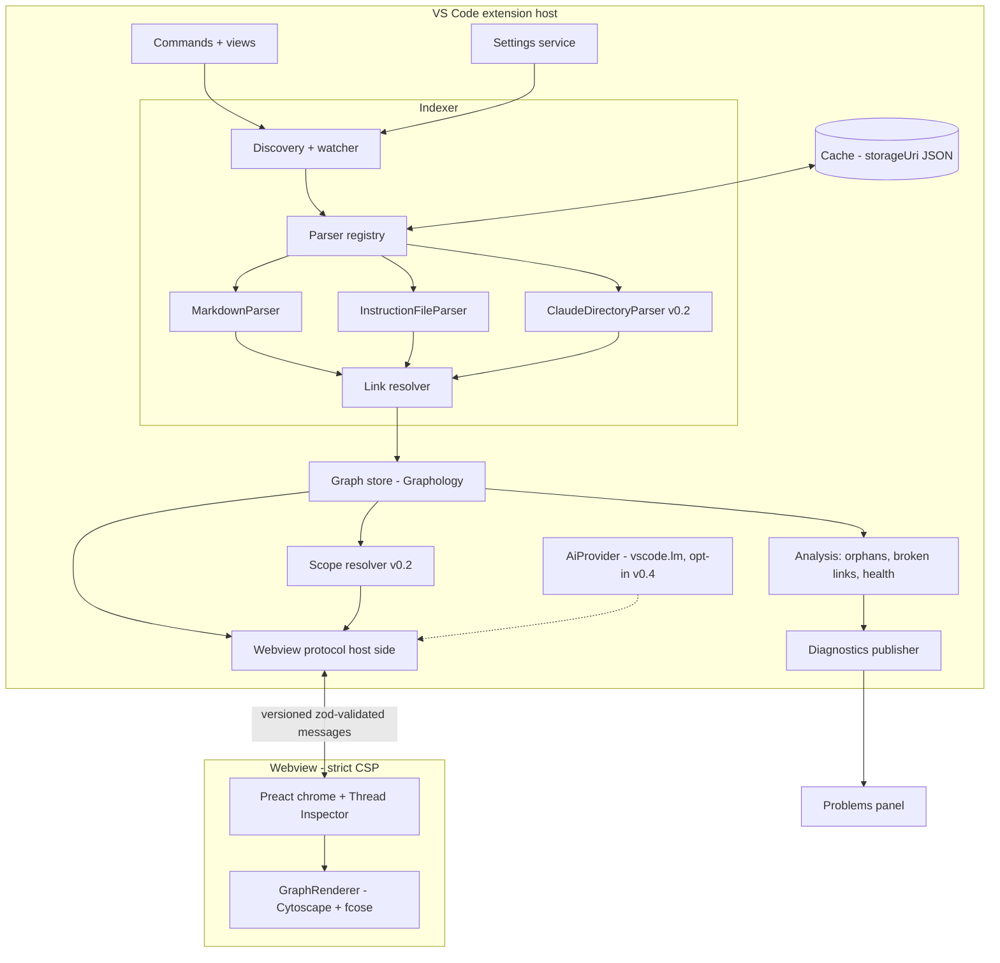
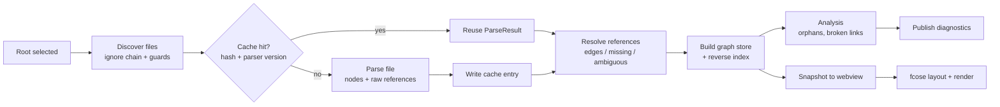
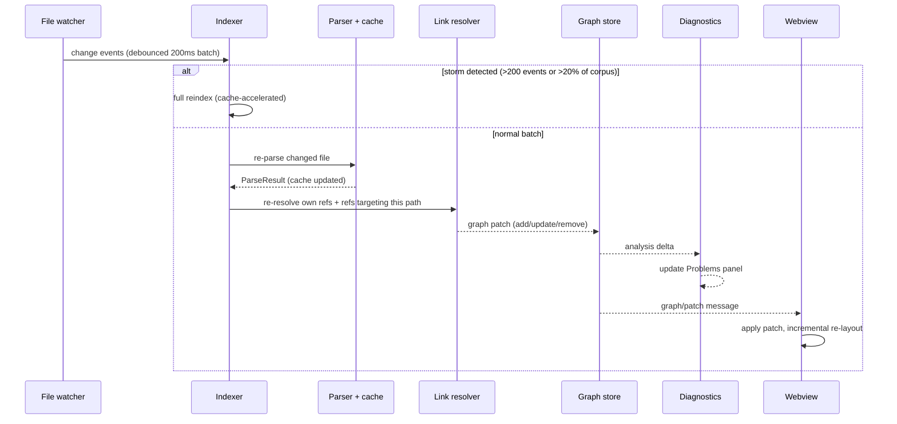
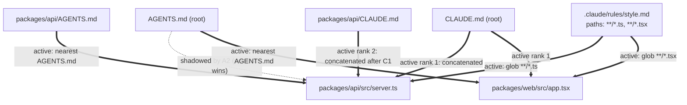
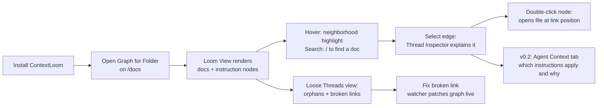

# ContextLoom — Product & Technical Plan

> **See how your repository's context is woven together.**

| | |
|---|---|
| **Status** | Approved for implementation |
| **Date** | 2026-07-13 |
| **Deliverable** | Implementation-ready plan for the ContextLoom VS Code extension |
| **Audience** | The implementing engineer/agent, plus prospective contributors |
| **Contains** | Product definition, architecture, backlog, risks. **No production code** — TypeScript appears only as interface sketches. |

**How to read this document.** Sections A–Z follow the planning brief. Section 7 gives the fourteen binding technical recommendations, Section 8 the architecture diagrams, Section 9 a worked sample graph, and Section 10 the closing summary (MVP definition, stack, first ten tasks, top risks, prototype validations, pitch). Decisions are written as decisions, not options; alternatives appear only where the trade-off genuinely matters. Format specifications in Section E and G were verified against first-party documentation (agents.md spec, Anthropic Claude Code docs, Cursor, GitHub Copilot, Windsurf/Devin docs) in July 2026; verification gaps are flagged inline. Library versions and maintenance claims in Sections I and 7 were verified against the npm registry and project repositories in July 2026.

**Implementer notes.** Work the backlog in Section X in order — it is dependency-sorted. Phase 0 spikes (Section W) come first; they de-risk the three decisions flagged in Section 10.5 before significant code exists. When this document and the brief disagree, this document wins; when this document is silent, prefer the product principles in Section B.

---

# A. Executive summary

**What it is.** ContextLoom is a VS Code extension that turns a repository's documentation and AI-agent configuration into a navigable, typed knowledge graph. Point it at a repo (or a subdirectory like `/docs`) and it renders Markdown documents, `AGENTS.md`/`CLAUDE.md` instruction files, `.claude/` agents, skills, and commands as nodes, with their links, containment, and applicability relationships as edges — rendered in a native VS Code webview with search, filters, and an inspector that explains every relationship.

**The problem.** Repository knowledge is fragmenting across two worlds: human documentation (READMEs, ADRs, runbooks, architecture notes) and agent context (AGENTS.md, CLAUDE.md, `.claude/skills`, Cursor rules, Copilot instructions). Neither world has a map. Developers can't see which documents are orphaned or stale, which links are broken, or — increasingly important — *which agent instructions actually apply to the file they're editing*. Agent config formats have real, subtle scoping semantics (nearest-ancestor precedence, glob activation, concatenation order) that today live only in each vendor's docs and each developer's head.

**Who it's for.** (1) Individual developers with documentation-heavy projects; (2) engineering teams with distributed docs, ADRs, and runbooks; (3) AI-assisted developers using Claude Code, Codex, Cursor, Copilot, or Windsurf; (4) maintainers of agent-framework configuration who need to see and validate the instruction surface of their repos.

**What makes it different.** The graph is typed and agent-aware. Competing tools are either dormant (`md-graph`, Markdown Links — both unmaintained; Dendron in maintenance mode since 2023) or methodology-first (Foam is an actively maintained PKM you must *adopt* — wikilink conventions, note templates). ContextLoom is **zero-config on existing repos**: it reads what's already there. And nothing else on the market models agent-instruction scope: ContextLoom's scope resolver answers "which instructions apply to this file?" deterministically, per format, with verified semantics — nearest-wins for AGENTS.md, root-to-leaf concatenation for CLAUDE.md, glob activation for Cursor/Copilot rules — and shows its reasoning.

**MVP (v0.1).** Select a graph root; discover Markdown; parse standard links + wiki links with source positions; render an interactive graph (open/navigate/search/filter); detect broken links and orphans (Loose Threads); refresh incrementally on file changes; recognize `AGENTS.md` and `CLAUDE.md` as typed instruction nodes; ship on a maintainable plugin-parser architecture with diagnostics in the Problems panel.

**Explicitly deferred.** Full instruction-scope resolution and `.claude/` agent/skill/command parsing (v0.2). Weave Health analysis suite (v0.3). Heuristic similarity and opt-in LLM features via VS Code's `vscode.lm` API (v0.4+). Never in scope: a Markdown editor, an Obsidian replacement, cloud sync, mandatory embeddings, or a full source-code call graph.

---

# B. Product principles

1. **Repository-native, zero adoption cost.** ContextLoom reads what already exists. It never asks a repo to restructure, adopt naming conventions, or add ContextLoom-specific files. (This is the line between us and Foam/Dendron/Obsidian.)
2. **Local-first, private by default.** All indexing and analysis happens on-machine. No network calls, no telemetry, no account. The extension works fully offline forever.
3. **Every edge is explainable.** Selecting any relationship shows *why it exists*: source file, line, parser, and whether it is explicit or inferred, with what confidence. Inferred relationships are visually and structurally distinct from explicit ones — never commingled.
4. **Useful without AI; AI is additive.** The core product — graph, navigation, broken links, scope resolution — is deterministic. LLM-assisted features are opt-in, clearly labeled, and every one has a non-AI fallback or degrades to absence.
5. **Fast enough to leave open.** Performance budgets (Section Q) are product requirements, not aspirations. The extension must never block the extension host or make VS Code feel worse.
6. **Deterministic core.** Same repository state ⇒ same graph, same diagnostics, byte-for-byte exportable. This makes the tool trustworthy, testable, and usable by agents as well as humans.
7. **Progressive complexity.** The first-run experience is a plain document graph. Agent awareness, health analysis, and inference layer on top — each independently toggleable, none required to get value.
8. **Respect the repository's boundaries.** Honor `.gitignore` and VS Code excludes, don't follow symlinks by default, never execute repository code, never write into the repo, and degrade safely in untrusted workspaces.

---

# C. Use cases and user stories

Each story: *As a … I want … so that …* → **Outcome** (the observable success condition; MVP stories are marked).

1. **Open a graph for `/docs`** *(MVP)* — As a developer, I want to run "ContextLoom: Open Graph for Folder" on `/docs` so I can see my documentation's structure. → **Outcome:** within ~1 s for a typical docs tree, a graph renders showing each Markdown file as a node and each resolved link as an edge; clicking a node opens the file.
2. **Open a graph for the whole workspace** *(MVP)* — As a developer, I want a workspace-wide graph so I can see all documentation and instruction files at once. → **Outcome:** graph opens scoped to the workspace root with default exclusions applied (`node_modules`, `.git`, build output, gitignored paths); instruction files are visually distinct from plain docs.
3. **Follow a Markdown link** *(MVP)* — As a reader, I want to traverse an edge to its target. → **Outcome:** selecting an edge shows source/target with the exact source line; "Open" jumps to the link's position in the editor.
4. **Find orphaned documents** *(MVP)* — As a maintainer, I want to list documents nothing links to. → **Outcome:** the Loose Threads view lists orphans (no incoming links, excluding designated entry points like the root README); clicking reveals the node in the graph.
5. **Filter by node type** *(MVP)* — As a user, I want to show/hide docs, instruction files, external URLs, and missing targets. → **Outcome:** toggling a type filter updates the graph in <100 ms without a re-layout jump.
6. **Inspect why two nodes are connected** *(MVP)* — As a user, I want to select an edge and understand it. → **Outcome:** the Thread Inspector shows edge type, source location, producing parser, and explicit/inferred provenance.
7. **View applicable `AGENTS.md` instructions for a file** *(v0.2)* — As an AI-assisted developer, I want to select any file and see which AGENTS.md files govern it. → **Outcome:** an ordered list: the nearest AGENTS.md marked *active*, ancestors marked *shadowed (nearest-wins per agents.md spec)*, with a note that some consumers (Cursor, VS Code) merge instead.
8. **View applicable `CLAUDE.md` / `.claude` resources** *(v0.2)* — As a Claude Code user, I want the resolved context for a file. → **Outcome:** the concatenation-ordered list of ancestor CLAUDE.md/CLAUDE.local.md files, `@import` expansions (depth ≤ 4), applicable `.claude/rules` (glob-matched), and discoverable skills/agents — each with the reason it applies.
9. **Discover skills and agents** *(v0.2)* — As an agent-config maintainer, I want to see every skill and agent defined in the repo. → **Outcome:** the Agents & Skills view lists `.claude/agents/**` and `.claude/skills/*/SKILL.md` with name/description from frontmatter; skill nodes connect to their supporting files and to agents that reference them.
10. **Detect broken links** *(MVP)* — As a maintainer, I want broken links surfaced automatically. → **Outcome:** links to nonexistent files produce a missing-target node in the graph and a warning in the Problems panel at the link's exact position.
11. **Detect duplicate/conflicting instructions** *(v0.3)* — As a team lead, I want to find contradictory or copy-pasted agent instructions. → **Outcome:** Weave Health flags exact-duplicate instruction blocks across files and highlights same-scope multi-format overlaps, without pretending to judge semantic conflicts it can't verify.
12. **Refresh after file changes** *(MVP)* — As a writer, I want the graph to track my edits. → **Outcome:** saving a file updates its node/edges within ~150 ms via an incremental patch; no full re-layout, no flicker.
13. **Work in a monorepo** *(MVP scale; scope semantics v0.2)* — As a platform engineer, I want per-package docs and nested instruction files handled correctly. → **Outcome:** nested `AGENTS.md` files each become scoped instruction nodes; in v0.2, scope queries respect package-level nearest-wins (Section G worked example).
14. **Multi-root workspaces** *(v0.2)* — As a user of multi-root workspaces, I want per-folder graphs. → **Outcome:** each workspace folder indexes independently; the root picker lists all folders; nothing crashes or cross-links between folders.
15. **Untrusted workspace** *(MVP)* — As a security-conscious user, I want safe behavior before I trust a folder. → **Outcome:** ContextLoom activates in limited mode: read-only indexing works, LLM features and `Export` are disabled, and a badge explains why (Section R).

---

# D. Scope definition

## MVP — v0.1 "The Loom"

The smallest release that is genuinely useful and differentiated: a fast, trustworthy Markdown graph that already *sees* agent instruction files.

- Graph root selection: workspace root, any folder (Explorer context menu), or `contextloom.roots` setting; multiple saved roots.
- File discovery honoring `.gitignore`, VS Code excludes, and ContextLoom include/exclude globs.
- Markdown parsing with full source positions: inline links, reference-style links, images, autolinks, fragments, headings, frontmatter (title/tags), wiki links `[[target]]`, `[[target|alias]]`, `[[target#heading]]`.
- Link resolution: relative paths, root-relative paths, fragment validation against heading slugs, wiki-link resolution (shortest-unique basename, Obsidian-style; ambiguity produces a diagnostic, not a guessed edge).
- Interactive Loom View (webview): pan, zoom, select, hover-highlight neighborhood, open file, reveal in Explorer, search, type filters, fcose layout with incremental re-layout.
- Thread Inspector panel: node/edge details, provenance, incoming/outgoing lists.
- Loose Threads: orphan list + broken-link list (view and Problems-panel diagnostics).
- Incremental refresh via file watcher (create/change/delete/rename), debounced, cancellable.
- **Instruction-file recognition:** `AGENTS.md`, `CLAUDE.md`, `CLAUDE.local.md`, `.claude/CLAUDE.md` become typed `instruction` nodes (distinct shape/color), including nested ones, with their outgoing Markdown links and `@import` references parsed. *(Recognition only — the scope-resolution engine is v0.2.)*
- Plugin parser architecture (Section K) with two parsers shipping: `MarkdownParser`, `InstructionFileParser`.
- Content cache keyed by content hash + parser version.
- Textual Graph Outline view (accessibility path, Section S).
- Settings (Section N, MVP-flagged subset), Problems diagnostics, `Export Graph` as JSON.

**Decision — agent parsing in 0.1 vs 0.2:** *recognition* of AGENTS.md/CLAUDE.md ships in 0.1 (cheap: a filename classifier + the existing Markdown parser; it is the visible differentiation on day one). *Semantics* — scope resolution, `.claude/` directory parsing, skills/agents/commands — ship in 0.2, because they need the format-adapter layer and its test fixtures to be trustworthy, and shipping wrong scope answers is worse than shipping none.

## v0.2 — "Agent Context"

- Scope-resolution engine (Section G) + **"ContextLoom: Show Applicable Agent Context"** command and Inspector panel.
- `.claude/` directory parsing: `agents/**/*.md` (frontmatter identity), `skills/*/SKILL.md` (+ supporting-file containment, `scripts/`/`references/`/`assets/` conventions), `commands/**/*.md` (parsed with the skills code path — Claude Code merged commands into skills), `rules/**/*.md` with `paths` glob activation, `settings.json` (permissions/hooks surfaced as metadata only).
- `applies-to` edges rendered on selection (not permanently, to avoid hairballs).
- Cursor `.cursor/rules/**/*.mdc` adapter (tolerant glob parsing: string and list forms).
- Agents & Skills view; multi-root workspace support; `CLAUDE.md` `@import` graph (depth 4) with cycle detection.

## v0.3 — "Weave Health"

- Health-check suite (Section P) with severity classification and per-check toggles; dedicated Weave Health view.
- Copilot (`.github/copilot-instructions.md`, `instructions/*.instructions.md` with `applyTo`) and Windsurf/Devin (`.devin/rules` > `.windsurf/rules`, `trigger` modes) adapters.
- Heading-level nodes (on-demand expansion), directory aggregation for large graphs, richer filtering (tag, frontmatter, path).
- Local heuristics: duplicate-section candidates, related-document suggestions (lexical), stale-doc detection via Git mtime.
- Editor decorations for broken links; CodeLens on instruction files ("applies to N files").

## v1.0 — stability bar

All of the following must be true: the graph model and parser API are documented and semver-stable; scope resolution passes the fixture matrix for AGENTS.md, Claude, Cursor, Copilot, and Windsurf; 10k-file repos index with progress UI and the degradation ladder engages automatically; Windows/macOS/Linux CI is green including path/symlink fixtures; accessibility Section S MVP+fast-follow items are done; docs set (Section V) complete; published on Marketplace + Open VSX with a pre-release channel; crash-free incremental updates under watcher storms (branch switches).

## v0.4+ — "Intelligent Context" (post-1.0 track acceptable)

Opt-in LLM features via `vscode.lm` (Section O): semantic similarity edges, summaries, conflict analysis, natural-language graph queries.

## Explicit non-goals

- **Not a Markdown editor** — VS Code already is one; we navigate and analyze.
- **Not an Obsidian/Foam replacement** — no vault conventions, no note templates, no daily notes.
- **Not a general diagramming tool** — the graph is derived from repository state, never hand-drawn.
- **Not an autonomous agent** — ContextLoom informs agents and humans; it never edits files or executes repo code.
- **No cloud sync, no accounts, no server component.**
- **No mandatory embeddings** — vector features, if ever added, are opt-in and local-first.
- **No full source-code call graph** — source files appear only as link *targets* (and later as scope subjects); we are not a code-intelligence engine.

# E. Supported repository formats

## E.1 Markdown

Parsing uses `mdast-util-from-markdown` (micromark core) with GFM and frontmatter extensions and a **vendored** wiki-link tokenizer (Section 7.4). Every extracted construct carries `{line, column, offset}` positions.

| Construct | Parsed | Graph effect | Phase |
|---|---|---|---|
| Inline link `[t](./a.md)` | ✅ | `link` edge to resolved file | MVP |
| Reference-style link `[t][ref]` + definition | ✅ | `link` edge (definition position recorded) | MVP |
| Link with fragment `./a.md#setup` | ✅ | `link` edge + fragment validated against target's heading slugs (GitHub slugger algorithm, duplicate suffixing) | MVP |
| Intra-file anchor `#setup` | ✅ | no edge; validated → diagnostic if missing | MVP |
| Wiki link `[[doc]]`, `[[doc\|alias]]`, `[[doc#h]]` | ✅ | `wiki-link` edge; resolution: shortest-unique basename within root; ambiguity ⇒ diagnostic + Loose Threads entry, **no guessed edge** | MVP |
| Image `` | ✅ | `references` edge to asset node (hidden by default filter) | MVP |
| External URL | ✅ | `link` edge to `url:` node; external nodes **collapsed into a per-document badge by default**, expandable via filter | MVP |
| Link to source file `./src/x.ts` | ✅ | `references` edge to `source-file` node | MVP |
| Link to directory `./docs/` | ✅ | `references` edge to `dir:` node | MVP |
| Autolink `<https://…>` | ✅ | as external URL | MVP |
| Frontmatter (YAML) | ✅ | node metadata: `title`, `tags`, `description`; malformed YAML ⇒ diagnostic, node still created | MVP |
| Headings | ✅ | slug table for fragment validation; heading **nodes** on-demand only | slugs MVP, nodes v0.3 |
| Tags (`#tag` in frontmatter `tags:`) | ✅ | metadata + filter facet (no tag nodes initially) | MVP metadata, facet v0.3 |
| Backlinks | derived | not stored; computed from the reverse edge index, shown in Inspector | MVP |
| HTML in Markdown | ❌ ignored | never rendered, never traversed (Section R) | — |

**What appears in the graph:** document-level nodes and file-to-file edges. Heading nodes are modeled (stable IDs exist) but only materialized in the view on explicit expansion (v0.3) — Obsidian's graph teaches that heading-level nodes by default create hairballs.

## E.2 Agent instruction files (verified semantics, July 2026)

**`AGENTS.md`** (agents.md open spec): plain Markdown, no frontmatter, placeable in any directory. Spec semantics: *the nearest AGENTS.md in the ancestor chain takes precedence* (override, not merge); explicit user prompts outrank files. 60+ adopting tools (Codex, Cursor, Copilot, Gemini CLI, Zed, Windsurf, …). **Claude Code does not read AGENTS.md natively** — interop is via `@AGENTS.md` import from CLAUDE.md or a symlink. Some consumers (Cursor, VS Code) *merge* nested files with specificity preference instead of pure override; the scope resolver models both behaviors (Section G).

**`CLAUDE.md` family** (Anthropic docs): load order managed-policy → user `~/.claude/CLAUDE.md` → project `./CLAUDE.md` or `./.claude/CLAUDE.md` → `./CLAUDE.local.md` (appends after project file). Ancestor files from cwd up are **all loaded and concatenated root→leaf — never overriding**. CLAUDE.md files in *descendant* directories lazy-load when files there are read. `@path` imports: recursive, max depth 4, skipped inside code spans/fences, relative to the importing file. ContextLoom indexes **repository-local files only**; user-global (`~/.claude`) and managed layers are out of scope by default (a future opt-in may *display* that they exist, never their content).

## E.3 Claude-related configuration (`.claude/`)

| Artifact | Location | Identity & metadata extracted | Graph representation |
|---|---|---|---|
| Settings | `.claude/settings.json`, `settings.local.json` | JSON keys (permissions, hooks, env) | metadata on a `config` node; not expanded into sub-nodes |
| Subagents | `.claude/agents/**/*.md` (recursive) | Frontmatter: `name` (identity — **not** the filename), `description`, `tools`, `model`, `skills`, `memory`, … | `agent` node; `uses-skill` edges from `skills:`; body links parsed as references |
| Skills | `.claude/skills/<name>/SKILL.md` | Frontmatter: `name` (must match directory), `description`, `when_to_use`, `allowed-tools`, `paths` (glob activation), spec fields `license`/`compatibility`/`metadata` | `skill` node anchored at SKILL.md; `contains` edges to supporting files in the skill directory (`scripts/`, `references/`, `assets/` conventions); `applies-to` from `paths` globs |
| Commands | `.claude/commands/**/*.md` | Same frontmatter family — Claude Code merged commands into skills; skill wins same-name collisions | `command` node, parsed by the skills code path |
| Rules | `.claude/rules/**/*.md` | Frontmatter: `paths` (YAML glob list, brace expansion). No `paths` ⇒ always-on | `rule` node; `applies-to` edges via glob |
| Nested skills | `<pkg>/.claude/skills/` | Directory-qualified names (`apps/web:deploy`) on clashes | qualified label; scoped to package |

Only repository-local configuration is indexed. Name-conflict precedence (enterprise > personal > project; skill > command) is recorded as node metadata so the Inspector can explain shadowing without ContextLoom resolving *content*.

## E.4 Additional format adapters

| Format | Files | Scoping | Phase |
|---|---|---|---|
| Cursor rules | `.cursor/rules/**/*.mdc` (extension mandatory; nested dirs) | 4 modes from `description`/`globs`/`alwaysApply`; legacy `.cursorrules` read-only recognition | v0.2 |
| Copilot | `.github/copilot-instructions.md`; `.github/instructions/**/*.instructions.md` (`applyTo` comma-separated globs, workspace-relative, additive); `.github/prompts/*.prompt.md` | always-on + glob; prompts are manual commands | v0.3 |
| Windsurf/Devin | `.devin/rules/**` (takes precedence) and `.windsurf/rules/**`, subdirs + parents to git root; legacy `.windsurfrules` | `trigger`: `always_on` / `model_decision` / `glob` / `manual` | v0.3 |
| ADRs | `docs/adr/**`, `docs/decisions/**` (convention detection: `NNNN-title.md`) | n/a — typed as `adr` document subtype | v0.3 |
| README / changelogs / architecture docs | name conventions | document subtypes (entry-point flag for orphan logic) | MVP (classification only) |
| Generic prompt dirs, package manifests, source symbols | — | — | post-1.0, community adapters |

**Caveats encoded as tolerant parsing:** Cursor and Windsurf glob dialects are underdocumented — the adapters accept both comma-separated-string and YAML-list forms and record `confidence: 0.8` on glob-derived `applies-to` edges from those two formats, with the raw frontmatter preserved in metadata.

All adapters implement the plugin parser interface (Section K) — adding a format never touches the graph engine.

---

# F. Graph domain model

## F.1 Identity

Node IDs are **identity-prefixed, workspace-relative, `/`-normalized, case-preserved** strings:

```text
file:docs/architecture.md          any file-backed node (document, instruction, agent, skill, …)
dir:packages/api                   directory
heading:docs/architecture.md#deploy   heading (GitHub slug, -1/-2 dedupe suffixes)
missing:docs/rollback.md           normalized resolved path that does not exist
url:https://example.com/page       normalized external URL
```

**Decision (refines the draft type-prefixed scheme):** the prefix encodes *identity class*, not node type — the type (`document` vs `instruction` vs `skill`) is an attribute. Rationale: a file's classification can change (a doc gains SKILL.md semantics; AGENTS.md support toggled off) without changing its identity, so edges, pins, and caches survive reclassification. Recorded as ADR-04.

Edge identity: `edgeType|sourceId|targetId`. Multiple same-type links between the same pair collapse into one edge with `occurrences: SourceRange[]` and a count.

## F.2 Node and edge schema (interface sketch)

```ts
type Origin = "explicit" | "inferred";

interface Provenance {
  parserId: string;        // "markdown", "claude-dir", …
  parserVersion: number;   // bump invalidates cache entries from this parser
  origin: Origin;
  confidence: number;      // 1.0 for explicit; <1.0 only for inferred/tolerant parses
}

interface ContextNode {
  id: string;                       // Section F.1
  type: NodeType;
  label: string;                    // frontmatter title > first H1 > filename
  path?: string;                    // workspace-relative; absent for url:/missing:
  range?: SourceRange;              // defining location (e.g. SKILL.md frontmatter)
  scope?: string;                   // owning directory for scoped artifacts
  metadata: Record<string, unknown>; // frontmatter, sizes, mtimes, format-specific fields
  provenance: Provenance;
  cacheable: boolean;               // false for nodes derived from git state etc.
}

interface ContextEdge {
  id: string;
  type: EdgeType;
  source: string; target: string;   // node IDs
  occurrences: SourceRange[];       // every source location producing this edge
  metadata: Record<string, unknown>;
  provenance: Provenance;
  cacheable: boolean;
}
```

## F.3 Node types

| Type | Examples | Notes | Phase |
|---|---|---|---|
| `document` | `docs/architecture.md` | subtypes via metadata: `readme`, `adr`, `changelog` | MVP |
| `instruction` | `AGENTS.md`, `CLAUDE.md`, rule files | metadata: format, activation mechanism | MVP (recognition) |
| `agent` | `.claude/agents/reviewer.md` | identity = frontmatter `name` in metadata | v0.2 |
| `skill` | `.claude/skills/deploy/SKILL.md` | | v0.2 |
| `command` | `.claude/commands/ship.md` | skills code path | v0.2 |
| `directory` | `dir:docs` | compound/group node in the view | MVP |
| `heading` | `heading:…#deploy` | modeled MVP, rendered v0.3 | v0.3 view |
| `source-file` | `src/server.ts` | only when referenced or scope-queried | MVP (as link target) |
| `external` | `url:…` | collapsed badge by default | MVP |
| `missing` | `missing:docs/gone.md` | dashed ghost node | MVP |

## F.4 Edge types

| Type | Origin | Meaning | Phase |
|---|---|---|---|
| `link` | explicit | Markdown link/image/autolink | MVP |
| `wiki-link` | explicit | `[[…]]` | MVP |
| `contains` | explicit | dir→child; skill→supporting file; doc→heading | MVP |
| `references` | explicit | non-doc targets (source files, dirs, assets); `@import` in CLAUDE.md | MVP |
| `broken-ref` | explicit | any of the above whose target is `missing:` | MVP |
| `applies-to` | explicit (derived) | instruction/rule/skill → file or dir it governs (scope resolver output) | v0.2 |
| `inherits-from` | explicit (derived) | nested instruction → ancestor of same format | v0.2 |
| `overrides` | explicit (derived) | nearest-wins shadowing (AGENTS.md semantics) | v0.2 |
| `uses-skill` | explicit | agent frontmatter `skills:` → skill | v0.2 |
| `defines-agent` | explicit | `.claude/agents` dir → agent node | v0.2 |
| `duplicate-of` | inferred | exact-duplicate instruction blocks (hash-based ⇒ confidence 1.0 but flagged inferred-class for UI) | v0.3 |
| `related-concept` | inferred | lexical similarity | v0.3 |
| `semantic-similarity` | inferred | LLM/embedding, opt-in | v0.4 |

Backlinks are **not** stored — they are the reverse index, computed once and exposed by the store.

**Inferred-edge containment rule:** every consumer (renderer, exporter, diagnostics) filters on `provenance.origin` explicitly; the default Loom View renders inferred edges dashed, in a separate toggle group, and *off* until the user enables them. This is the structural guarantee that later AI features can't pollute the explicit graph.

## F.5 Caching contract

A node/edge is cacheable iff it is a pure function of `(file content, parser version, workspace-relative path)`. Derived edges (`applies-to`, `overrides`) are recomputed from cached parse results, not cached themselves. Git-derived metadata (staleness) is never cached.

---

# G. Instruction-scope resolution

The differentiating feature. Target question: **"Which repository instructions apply to file X — and why?"**

## G.1 Conceptual model

Verified across all supported formats, exactly three orthogonal **activation mechanisms** exist:

1. **Ancestry** — the file's directory chain selects instruction files (AGENTS.md nearest-wins; CLAUDE.md concatenate-all; Windsurf rules dirs attach from parents).
2. **Glob** — frontmatter patterns select files (`paths` in Claude rules/skills, `globs` in Cursor, `applyTo` in Copilot, `trigger: glob` in Windsurf). Dialects differ per tool ⇒ pluggable matcher per adapter.
3. **Mode** — always-on / model-decision / manual (`alwaysApply`, `trigger: always_on`, rules without `paths`, `@mention`-only). Model-decision and manual entries are *reported as conditional*, never claimed active.

A **format adapter** owns its format's semantics and emits `ScopeMatch` records; the resolver never merges *across* formats — different tools read different files, and pretending otherwise invents certainty.

```ts
interface ScopeMatch {
  source: string;            // node ID of the instruction/rule/skill
  format: "agents-md" | "claude-md" | "claude-rules" | "cursor" | "copilot" | "windsurf";
  mechanism: "ancestry" | "glob" | "always" | "model-decision" | "manual";
  status: "active" | "shadowed" | "conditional";
  rank: number;              // ordering within format (e.g. concatenation order)
  reason: string;            // human sentence, e.g. "nearest AGENTS.md (2 levels up)"
}
```

## G.2 Deterministic algorithm

```text
resolveContext(filePath):
  assert filePath is inside the workspace (scope resolution is always
  workspace-wide, even when the graph *view* root is a subdirectory)
  matches = []
  for adapter in enabledAdapters (fixed registration order):
    matches += adapter.matches(filePath, index)
  group by format; within each format sort by rank; return groups
```

Per-adapter semantics (each a pure function of the index — no I/O):

- **agents-md:** collect `AGENTS.md` in `dir(filePath)` and all ancestors to workspace root. Nearest ⇒ `active`; the rest ⇒ `shadowed` with an `overrides` edge nearest→ancestor. Setting `contextloom.agents.agentsMdMode: "nearest" | "merge"` (default `"nearest"`, per spec) flips shadowed→active-merged for Cursor/VS Code-style consumers.
- **claude-md:** collect `CLAUDE.md`, `.claude/CLAUDE.md`, `CLAUDE.local.md` in ancestors; **all** `active`, rank = root-first concatenation order, `CLAUDE.local.md` ranked after its sibling. Expand `@imports` (depth ≤ 4, cycle-safe) as `references` with rank inherited. Never marks ancestors shadowed — concatenation, not override.
- **claude-rules / skills `paths`:** glob match (picomatch with brace expansion) against the workspace-relative path ⇒ `active (glob)`. Rules without `paths` ⇒ `active (always)`. Skills without `paths` ⇒ `conditional (model-decision)`.
- **cursor:** `.mdc` in `.cursor/rules/**` of ancestor dirs; `alwaysApply` ⇒ active; `globs` match ⇒ active; description-only ⇒ conditional; neither ⇒ manual. Glob strings parsed tolerantly (comma-string or list), confidence 0.8.
- **copilot:** `copilot-instructions.md` ⇒ always active; `*.instructions.md` where `applyTo` matches ⇒ active; both together (additive per GitHub docs).
- **windsurf:** `.devin/rules` before `.windsurf/rules`; `trigger` mode maps directly to status.

Edge cases: **symlinks** are not followed during discovery (default), so symlinked instruction files resolve at their physical path only; **excluded directories** contribute no instruction files — but if a *visible* file's ancestor chain passes through an excluded dir that contains an AGENTS.md, ContextLoom emits an info diagnostic ("instructions may exist in excluded path") rather than silently lying; **files outside the graph root** still resolve (workspace-wide discovery, view-scoped rendering); **monorepo package boundaries** are not treated as walls in v0.2 (pure ancestry — matches every verified tool's actual behavior); package-aware grouping is a v0.3 view feature only.

## G.3 Worked example

```text
repo/
├── AGENTS.md                 (A1)
├── CLAUDE.md                 (C1)
├── packages/
│   ├── api/
│   │   ├── AGENTS.md         (A2)
│   │   ├── CLAUDE.md         (C2)
│   │   └── src/server.ts
│   └── web/src/app.tsx
└── .claude/rules/style.md    (R1: paths: ["**/*.ts", "**/*.tsx"])
```

**`packages/api/src/server.ts`:**

| Source | Format | Status | Reason |
|---|---|---|---|
| A2 | agents-md | **active** | nearest AGENTS.md (1 level up) |
| A1 | agents-md | shadowed | overridden by A2 (nearest-wins; merged instead under Cursor/VS Code semantics) |
| C1 | claude-md | active (rank 1) | ancestor CLAUDE.md — concatenated first |
| C2 | claude-md | active (rank 2) | nearer CLAUDE.md — concatenated after C1, **does not override it** |
| R1 | claude-rules | active | glob `**/*.ts` matched |

**`packages/web/src/app.tsx`:** A1 active (nearest is root), C1 active, R1 active (`**/*.tsx`). No shadowing.

## G.4 Visualization and conflict surfacing

- `applies-to` edges render **on selection only** (select a file → its instruction sources glow; select an instruction → its scope subtree highlights). Persistent rendering of scope edges is a hairball generator.
- The **Agent Context panel** (Inspector tab) shows the grouped table above, one group per format, each row with its `reason` sentence and a jump-to-source link.
- **Conflicts are reported, never resolved:** when multiple sources of the *same format* are simultaneously active with overlapping scope (e.g. two always-on Cursor rules, or AGENTS.md in merge mode), ContextLoom lists them as "all apply — order shown is the tool's documented reading order" and, where the format documents no order (Windsurf duplicates), says exactly that. Semantic contradiction detection is out of deterministic scope (see Section O for the opt-in LLM version).

## G.5 Validation oracle

Claude Code's `InstructionsLoaded` hook event fires per loaded CLAUDE.md/rule file — Phase 2 testing uses it as a ground-truth oracle: run Claude Code against fixture repos, capture which files it actually loads, and assert the resolver agrees. (Test-time technique only; ContextLoom never executes anything at runtime.)

# H. UX and interaction design

Product language: loom vocabulary names the surfaces (**Loom View**, **Thread Inspector**, **Loose Threads**, **Weave Health**, **Agent Context**), but every UI label pairs metaphor with a plain descriptor — "Loose Threads — orphans & broken links" — and command IDs/settings stay literal. If usability testing shows the metaphor confuses, the descriptors already carry the meaning. Node/edge/relationship stay plain ("Context Node" and "Context Thread" are documentation vocabulary only).

## H.1 Activity Bar container

| View | Content | Phase |
|---|---|---|
| **Graph Roots** | saved roots (from `contextloom.roots` + ad-hoc), click to open Loom View | MVP |
| **Loose Threads** | orphans + broken links + ambiguous wiki links, grouped, click-to-reveal | MVP |
| **Graph Outline** | textual tree of nodes/edges (accessibility path, Section S) | MVP |
| **Agents & Skills** | agents, skills, commands, rules with descriptions | v0.2 |
| **Weave Health** | health checks grouped by severity | v0.3 |

## H.2 Loom View (webview) interactions

| Interaction | Behavior | Phase |
|---|---|---|
| Pan / zoom | drag / wheel + trackpad; zoom buttons + `+`/`-` keys | MVP |
| Select | click node/edge → Thread Inspector updates | MVP |
| Multi-select | shift-click, box-select | v0.2 |
| Hover | highlight node + neighborhood, fade rest (Obsidian-style) | MVP |
| Open file | double-click / `Enter` → opens at defining position | MVP |
| Context menu | Reveal in Explorer, Copy path, Center on node, Show neighbors, Hide node, Pin node | MVP (Hide/Pin v0.2) |
| Search | `/` focuses search; typeahead; match → center + select | MVP |
| Filter | node-type toggles; edge-type toggles; inferred-edges master toggle | MVP |
| Change root | root picker in toolbar | MVP |
| Change layout | fcose (default) / concentric / grid | v0.2 |
| Re-run analysis | refresh button = full reindex | MVP |
| Neighborhood expand | show-neighbors on demand (large-graph mode) | v0.3 |

## H.3 Thread Inspector

Sidebar panel (inside the webview, right side). On selection shows: label + type badge + path (click to open); extracted metadata (frontmatter, format, activation mechanism); incoming / outgoing relationship lists (backlinks live here); broken references originating from the node; provenance (parser, version, explicit/inferred, confidence); for edges, every source occurrence with line numbers; **Agent Context tab** (v0.2): the Section G grouped table for the selected file.

## H.4 Commands

```text
contextloom.openGraph              ContextLoom: Open Graph                (MVP)
contextloom.openGraphForFolder     ContextLoom: Open Graph for Folder     (MVP, Explorer context menu)
contextloom.focusCurrentFile       ContextLoom: Focus on Current File     (MVP)
contextloom.findLooseThreads       ContextLoom: Find Loose Threads        (MVP)
contextloom.refreshGraph           ContextLoom: Refresh Graph             (MVP)
contextloom.exportGraph            ContextLoom: Export Graph (JSON)       (MVP)
contextloom.showAgentContext       ContextLoom: Show Applicable Agent Context (v0.2)
```

## H.5 Editor integration (deliberately thin in MVP)

MVP: Explorer context menu ("Open Graph for Folder"), editor-title icon on Markdown files (Focus on Current File), Problems-panel diagnostics for broken links, status-bar item showing index state (`⟳ indexing… / ✓ 214 nodes`) that opens the Loom View. Deferred: broken-link editor decorations + hovers (v0.3), CodeLens on instruction files (v0.3). Rationale: diagnostics already give in-editor visibility without new UI surface; decorations duplicate them until the core is stable.

---

# I. Graph visualization technology

Comparison (versions/bundle sizes verified against npm/bundlephobia, July 2026):

| Library | Render | Size (min+gz) | Ceiling | Maintenance | Fit notes |
|---|---|---|---|---|---|
| **Cytoscape.js 3.34** | canvas | ~135 KB | 2–5k fluid, 10k tuned | very active (June 2026 release) | richest built-ins: selectors (→ filters), compound nodes (→ directory grouping), incremental `add/remove`, box-select, styling stylesheets; fcose layout (`cytoscape-fcose` 2.2, MIT) is the ecosystem's best fast force layout with incremental re-layout |
| **Sigma.js 3.0.3 + Graphology 0.26** | WebGL | ~26 + 13 KB | 10k+ trivially | active; v4 alpha exists | TS-native; reducers = cheap hover-dim states; custom nodes need WebGL programs; needs working WebGL in the webview |
| force-graph 1.51 | canvas | ~57 KB | 2–3k smooth | active | fastest path to Obsidian *feel*; force-only layout, weak filtering machinery |
| D3 force (DIY) | BYO | ~6 KB core | render-bound | stable/finished | you own selection, hitboxes, labels — bespoke-renderer territory |
| React Flow 12 | DOM/SVG | ~59 KB + React | low thousands | very active | maintainers state not intended for 1000+ nodes; best a11y, wrong perf class |
| vis-network 10 | canvas | ~111 KB | 2–3k | community-run | dated API, mediocre physics at scale; no advantage remaining |

**Decision — default: Cytoscape.js + cytoscape-fcose.** For 50–2,000-node documentation graphs the contest is decided by product features, not FPS: selectors map one-to-one onto the filter UI, compound nodes give directory grouping for free, the mutation API matches the incremental-patch protocol, it's pure canvas (no WebGL availability risk in remote/SSH webviews), and it's actively maintained. At 10k nodes it survives with the Section Q degradation ladder.

**Fallback: Sigma.js v3 + Graphology.** The escape hatch if Phase 0 profiling shows canvas can't hold target hardware at the degraded 10k case.

**Structural hedge (binding):** the internal graph model is **Graphology from day one**, and the webview renderer sits behind a `GraphRenderer` interface (`mount`, `applyPatch`, `setFilters`, `focusNode`, `destroy`, selection/hover event emitters). Graphology is renderer-agnostic and 13 KB — this makes the fallback a renderer swap, not a rewrite, and its metrics/traversal packages serve orphan detection and layout off-thread.

---

# J. Extension architecture

## J.1 Layers

```text
src/
  extension/      activation, DI wiring, workspace-trust gate, disposables
  commands/       command registration → thin calls into services
  discovery/      root management, file enumeration, ignore handling, watcher
  parsers/        parser registry + MarkdownParser, InstructionFileParser, (v0.2) claude/*, cursor
  graph/          Graphology store, node/edge factories, patch computation, reverse index
  scope/          format adapters + resolveContext (v0.2)
  analysis/       orphans, broken links, (v0.3) health checks
  cache/          content-hash cache, serialization, invalidation
  diagnostics/    Problems-panel publisher (owns all vscode.Diagnostic state)
  webview/        panel lifecycle, message protocol host side, HTML/CSP scaffold
  settings/       typed config reader (zod), change events
  export/         JSON serializer
  testing/        fixture loaders, test utilities
webview-ui/       separate esbuild entry: Preact app + GraphRenderer (Cytoscape)
```

Responsibilities worth pinning: **activation** is lazy (`onView`, `onCommand` — no `*`); **discovery** owns "what files exist" and is the only module that touches `workspace.findFiles`/watchers; **parsers** are pure (bytes in → nodes/edges/diagnostics out, no `vscode` import — unit-testable in Vitest); **graph** owns identity, merging, patches; **diagnostics** is the single writer to the Problems panel; **webview** owns the protocol and never leaks `vscode` types into `webview-ui`. **Telemetry: none** — there is no telemetry module by design (Section R). **Export**: deterministic JSON (nodes, edges, metadata, schema version) — doubles as the format agents can consume.

## J.2 Webview framework

**Preact + `@vscode-elements/elements`** (the community successor to Microsoft's Webview UI Toolkit, which was deprecated Jan 2025 and archived). Preact (~4 KB gz) renders the chrome — toolbar, filters, Inspector; vscode-elements provides theme-correct controls. **The graph canvas lives outside Preact's render tree**: a plain DOM host div owned by the `GraphRenderer`; Preact communicates with it via the renderer interface, never via re-render.

## J.3 Message protocol (host ⇄ webview)

Envelope: `{ v: 1, id: string, type: string, payload: unknown }` — `v` is the protocol version (mismatch ⇒ webview shows "reload required"); `id` correlates request/response and cancellation. **Every payload is zod-validated on both sides**; validation failure logs + drops the message, never crashes.

```text
host → webview
  graph/snapshot      full graph (initial load / re-root / refresh)
  graph/patch         {addedNodes, updatedNodes, removedNodeIds, addedEdges, removedEdgeIds}
  graph/status        {state: "indexing" | "ready" | "degraded", counts, progress?}
  selection/details   Inspector payload for a requested node/edge
  config/update       filter defaults, appearance
  error               {message, recoverable}

webview → host
  ready               handshake; host replies with snapshot
  node/open           open file at range
  node/reveal         reveal in Explorer
  node/details        request Inspector payload
  view/search         query (host answers with match IDs — search runs host-side against the store)
  view/filters        active type/edge toggles (persisted to workspaceState)
  view/root           change root request
  export/request      trigger export
  cancel              {id} — host aborts the correlated operation
```

Loading states: webview renders skeleton until `graph/snapshot`; `graph/status: indexing` shows a progress bar fed by discovery counts; patches apply without layout reset (fcose incremental, pinned nodes respected). All state needed to restore a panel (root, filters, camera) persists via `webview.state` + `workspaceState`, so panel serialization/revival works across restarts.

---

# K. Parser architecture

```ts
interface FileSnapshot { path: string; contents: Uint8Array; hash: string; languageId?: string }

interface ParseContext {
  workspaceRoot: string;
  settings: ResolvedSettings;
  log: (msg: string) => void;
}

interface RawReference {           // parsers emit *unresolved* references…
  kind: "md-link" | "wiki-link" | "image" | "import" | "frontmatter-ref";
  rawTarget: string;               // "../a.md#setup", "[[Deploy Guide]]", "@AGENTS.md"
  range: SourceRange;
}

interface ParseResult {
  nodes: ContextNode[];
  references: RawReference[];      // …the LinkResolver turns these into edges
  edges: ContextEdge[];            // only for edges needing no resolution (contains)
  diagnostics: ParserDiagnostic[];
  scopeRules: ScopeRule[];         // glob/ancestry declarations for the scope engine
}

interface ContextParser {
  readonly id: string;             // "markdown"
  readonly version: number;        // bump ⇒ cache invalidation for this parser
  readonly patterns: string[];     // ["**/*.md"] — first-match-wins registration order
  enabled(settings: ResolvedSettings): boolean;
  parse(file: FileSnapshot, ctx: ParseContext): ParseResult;   // pure, sync, no I/O
  cacheDependsOn?(file: FileSnapshot): string[];               // extra paths whose change invalidates this file
}
```

**Two-phase design (the load-bearing decision):** parsers emit `RawReference`s; a separate **LinkResolver** resolves them against the file index into edges (or `missing:`/ambiguity diagnostics). Consequence: when a file is created/deleted/renamed, no other file needs *re-parsing* — only re-*resolution* of the raw references that could match it (found via a target-basename index). This is what makes incremental updates cheap and correct.

**Reconciliation:** node identity is the ID (F.1). If two parsers emit the same node ID, the registry merges: classification precedence `skill/agent/command > instruction > document` decides `type`; metadata is unioned (collision ⇒ namespaced by parserId + warning log); edges dedupe by edge identity with occurrence-list union. Parsers own disjoint pattern sets by default (`InstructionFileParser` claims `**/AGENTS.md` etc. before `MarkdownParser`'s `**/*.md`; both run where semantics differ — instruction parser delegates body parsing to the markdown parser internally rather than double-parsing).

Planned parsers: `MarkdownParser` (MVP), `InstructionFileParser` (MVP — AGENTS.md/CLAUDE.md classification + `@import` refs), `ClaudeDirectoryParser` (v0.2 — agents/skills/commands/rules/settings), `CursorRulesParser` (v0.2), `CopilotParser`, `WindsurfParser` (v0.3), `GenericPromptParser` (post-1.0). Third-party parser API is *not* public until v1.0 (interface may still move).

---

# L. Indexing and update strategy

## L.1 Initial index

```text
discover (findFiles + ignore filtering, streamed)
  → for each file: cache hit? (hash+parserVersion) reuse : parse
  → LinkResolver resolves all RawReferences
  → graph store build (Graphology) + reverse index
  → analysis (orphans, broken links) → diagnostics publish
  → webview snapshot
```

Concurrency-limited (8 files in flight), chunked with `await` yields so the extension host stays responsive, cancellable via `CancellationToken` (new index request cancels the running one), progress reported to status bar + webview. **Decision: no worker threads in MVP** — mdast parsing of docs-scale corpora is single-digit milliseconds per file; the escalation path (documented, not built) is a `worker_threads` parse pool behind the same parser interface, triggered if Phase 0 profiling shows >1 ms/KB average or 10k-file indexing beyond Section Q targets.

## L.2 Incremental updates

`FileSystemWatcher` events, coalesced with a 200 ms debounce into batches:

- **create/change:** re-parse file (cache update) → re-resolve its own references + all references *targeting* it (reverse/basename index lookup) → compute graph patch → analysis delta → diagnostics update → `graph/patch`.
- **delete:** drop nodes/edges for the path → re-resolve dangling references into `missing:` targets → patch.
- **rename:** VS Code delivers delete+create; the resolver naturally re-links references that named the new path. (No content-similarity rename heuristics — determinism principle.)
- **config change:** include/exclude/root changes ⇒ full reindex; parser toggles ⇒ selective reindex of that parser's patterns.
- **storm handling (branch switch / git operations):** if a debounce window collects > 200 events or > 20 % of the corpus, fall back to a full reindex (cache makes it cheap — unchanged hashes skip parsing).

## L.3 Cache

Location: `context.storageUri` (per-workspace) as a single JSON file (`index-cache-v{schemaVersion}.json`), written debounced + atomically (tmp + rename). Entry: `path → {contentHash, parserId, parserVersion, parseResult}`. Invalidation: content hash mismatch; parser version bump; schema version bump; settings hash change (include/exclude/wiki-link mode participate in the settings hash). Corrupt/unreadable cache ⇒ silent full reindex (cache is an optimization, never a source of truth). Size cap 50 MB ⇒ oldest-root eviction.

## L.4 Limits and progressive behavior

`contextloom.limits.maxFiles` (default 20,000): beyond it, indexing stops, the UI states exactly what was skipped (no silent truncation), and suggests narrowing the root. Progressive loading: the webview receives the snapshot when indexing completes for ≤ 2,000 files; above that, an initial snapshot at 2,000 + patches as parsing continues. Multi-root workspaces: one index + one cache per workspace folder; the root picker namespaces roots by folder.

---

# M. File discovery and exclusions

Discovery = `workspace.findFiles` with ContextLoom include globs, then a filter pipeline: VS Code `files.exclude`/`search.exclude` → `.gitignore` chain (via the `ignore` npm package, applied per-directory hierarchically, matching git's own precedence) → `contextloom.exclude` → binary/size guards (skip files > `limits.maxFileSizeKb`, default 1,024). Symlinks: not followed by default (`followSymlinks: false`); when enabled, realpath cycle detection with a visited-set.

Defaults:

```json
{
  "contextloom.roots": [],
  "contextloom.include": ["**/*.md", "**/*.mdc", "**/AGENTS.md", "**/CLAUDE.md", "**/SKILL.md"],
  "contextloom.exclude": ["**/node_modules/**", "**/.git/**", "**/dist/**", "**/build/**", "**/out/**", "**/vendor/**", "**/coverage/**"],
  "contextloom.followSymlinks": false,
  "contextloom.respectGitignore": true
}
```

(`.claude/**` is intentionally *not* excluded; dotfile traversal is enabled for the specific agent-config directories only: `.claude`, `.cursor`, `.github`, `.windsurf`, `.devin`.)

**Saved roots: yes** — `contextloom.roots` is an array; the Graph Roots view lists them plus ad-hoc roots opened this session, with a pin action to persist. Empty array ⇒ workspace root.

---

# N. Settings design

Principle: every setting must change observable behavior a user asked about; implementation details (debounce ms, concurrency) are constants, not settings.

| Key | Type | Default | Description | MVP |
|---|---|---|---|---|
| `contextloom.roots` | `string[]` | `[]` | Saved graph roots (workspace-relative). Empty = workspace root. | ✅ |
| `contextloom.include` | `string[]` | see M | Include globs. | ✅ |
| `contextloom.exclude` | `string[]` | see M | Exclude globs (additive to gitignore/VS Code excludes). | ✅ |
| `contextloom.respectGitignore` | `boolean` | `true` | Honor `.gitignore` chains. | ✅ |
| `contextloom.followSymlinks` | `boolean` | `false` | Follow symlinks during discovery. | ✅ |
| `contextloom.wikiLinks.enabled` | `boolean` | `true` | Parse `[[wiki links]]`. | ✅ |
| `contextloom.wikiLinks.resolution` | `"shortest-unique" \| "root-relative"` | `"shortest-unique"` | Wiki-link target resolution strategy. | ✅ |
| `contextloom.graph.showExternalLinks` | `boolean` | `false` | Render external URLs as nodes vs collapsed badge. | ✅ |
| `contextloom.graph.maxNodes` | `number` | `3000` | View-level cap before degradation ladder engages. | ✅ |
| `contextloom.diagnostics.enabled` | `boolean` | `true` | Publish broken-link/orphan diagnostics to Problems. | ✅ |
| `contextloom.limits.maxFiles` | `number` | `20000` | Hard indexing cap (explicit skip report). | ✅ |
| `contextloom.limits.maxFileSizeKb` | `number` | `1024` | Skip larger files (reported). | ✅ |
| `contextloom.agents.enabled` | `boolean` | `true` | Recognize agent instruction formats. | ✅ |
| `contextloom.agents.agentsMdMode` | `"nearest" \| "merge"` | `"nearest"` | AGENTS.md consumer semantics (spec vs Cursor/VS Code). | v0.2 |
| `contextloom.agents.formats` | `string[]` | `["agents-md","claude"]` | Enabled format adapters (`cursor`, `copilot`, `windsurf` added as shipped). | v0.2 |
| `contextloom.health.enabledChecks` | `string[]` | all deterministic | Weave Health check toggle list. | v0.3 |
| `contextloom.ai.enabled` | `boolean` | `false` | Master switch for LLM-assisted features (`vscode.lm`). | v0.4 |

Graph appearance (colors, node sizes) intentionally has **no settings** in MVP — it follows the active VS Code theme tokens; a curated appearance setting group can come with v0.3 once demand is evidenced.

# O. AI-specific features

Tiering rule: a feature lives in the lowest tier that can implement it correctly. Cloud AI is never a dependency of the core extension.

## O.1 Deterministic agent-aware features (no LLM, ships in v0.2–0.3)

Parse AGENTS.md / CLAUDE.md / `.claude/` / skills; resolve scope (Section G); show applicable context; detect exact-duplicate instruction blocks (normalized-hash comparison); detect broken references in instruction files (including `@imports`); detect unused skills (no agent `skills:` reference, no command, no doc link — reported with the caveat that model-invocation via description can't be ruled out); detect unreachable agent resources (files in `.claude/` referenced by nothing).

## O.2 Local heuristic features (lexical/statistical, v0.3)

Related-document suggestions (TF-IDF/BM25 over headings+body, top-5, shown only in Inspector — never auto-drawn as edges); similar-heading detection; duplicate-section candidates (shingle hashing); likely-stale references (target changed substantially after the linking document's last edit, using last-modified dates from VS Code's built-in Git extension API — opt-in); document clustering for the aggregated large-graph view. All heuristic outputs carry `origin: "inferred"` with computed confidence and render dashed/off-by-default (F.4 containment rule).

## O.3 LLM-assisted features (opt-in, v0.4+)

**Provider decision:** exclusively **`vscode.lm`** (stable VS Code Language Model API) initially — it uses the user's own Copilot-provisioned models, has a built-in first-use consent dialog, per-extension rate limits, and means ContextLoom never handles API keys or network endpoints. BYOK is a VS Code-level user feature, not ours to implement. A thin `AiProvider` interface isolates `vscode.lm` so a direct-API provider could be added later behind the same consent flow (ADR-09). Must handle the empty-model-list case gracefully (no Copilot ⇒ features hidden with an explanatory tooltip, not broken).

| Feature | User value | Data sent | Consent & controls | Failure mode / non-AI fallback |
|---|---|---|---|---|
| Semantic similarity edges | find related docs that share no links | pairs of doc excerpts (≤2 KB each), candidate-filtered by O.2 lexical prefilter | master switch + per-run confirmation listing files; gitignored files never sent | edges absent; lexical suggestions remain |
| Instruction conflict analysis | judge whether co-applying instructions contradict | the co-applying instruction texts for one scope query | per-invocation button ("Analyze with AI") | G.4 deterministic "all apply" listing |
| Document summaries | node tooltips for unfamiliar docs | single document body | per-invocation; cached in workspace storage | first paragraph shown instead |
| Missing-doc / context-gap suggestions | "packages/api has no README; CLAUDE.md doesn't mention the test runner" | directory listing + instruction texts | per-invocation | Weave Health structural checks |
| Suggested links | draft `[[links]]` for orphans | orphan body + candidate titles | per-invocation; suggestions are copy-paste, never auto-applied | orphan list only |
| NL graph queries | "which docs mention deployment but aren't linked from index?" | query + graph metadata (labels/paths, not bodies) | per-invocation | search + filters |

Cross-cutting: every AI result is labeled with the model ID and rendered in the inferred-edge visual class; costs are bounded by explicit invocation (no background LLM calls, ever); a "what was sent" disclosure link accompanies every result; rate-limit and API errors degrade to the deterministic fallback with a status-bar note.

---

# P. Weave Health analysis

Ships v0.3 as a check registry; each check declares id, severity, surfaces, and default-enabled. Noise control is a design requirement: defaults below were chosen so a typical healthy repo shows **zero errors and near-zero warnings**.

| Check | Severity | Surfaces | Default | Notes |
|---|---|---|---|---|
| Broken link (missing file target) | Error | Problems, graph (ghost node), Loose Threads | on | MVP feature, adopted into registry |
| Broken fragment (missing heading) | Warning | Problems, Inspector | on | |
| Ambiguous wiki link | Warning | Problems, Loose Threads | on | candidates listed |
| Agent references missing skill | Error | Problems, Agents & Skills | on | `skills:` entry with no match |
| `@import` cycle or depth > 4 | Error | Problems | on | Claude documented limit |
| Orphaned document | Info | Loose Threads, Health view | on | entry points (root README, index.md) exempt |
| Document with no outgoing links | Suggestion | Health view | off | often legitimate (leaf docs) |
| Duplicate title / duplicate H1 | Info | Health view | on | |
| Exact-duplicate instruction blocks | Warning | Health view, Inspector | on | normalized hash match across instruction files |
| Same-scope multi-source overlap | Info | Inspector, Health view | on | G.4: reported, not judged |
| Unused skill | Info | Agents & Skills, Health view | on | with model-invocation caveat |
| Unreachable `.claude` resource | Info | Health view | on | |
| Oversized instruction file | Warning | Health view | on | > 12,000 chars (Windsurf's documented per-file limit is the strictest real bound; configurable) |
| Very large document | Suggestion | Health view | off | > 100 KB |
| Stale document | Info | Health view | off (opt-in) | git last-modified > 12 months AND has incoming links |
| Instruction applies too broadly | Suggestion | Health view | off | always-on rule + repo > N files heuristic |

Surface policy: **Problems panel carries only Error/Warning** (things a maintainer should fix); Info/Suggestion live in the Weave Health and Loose Threads views. Every check is individually toggleable (`contextloom.health.enabledChecks`); severities are fixed (remapping adds confusion for no demonstrated need).

---

# Q. Performance targets

Measured on the reference machine class "2021 laptop, 4 cores, SSD"; enforced by benchmark tests in CI (Section T) against generated fixtures.

| Metric | Target |
|---|---|
| Extension activation (lazy triggers only) | < 50 ms added to VS Code startup; ideally not activated at all until used |
| Open graph, warm cache, 500 nodes | < 1 s to interactive |
| Initial index, 100 files | < 300 ms |
| Initial index, 1,000 files | < 2 s |
| Initial index, 10,000 files | < 15 s with progress UI; UI usable during |
| Incremental single-file update (save → webview patch) | < 150 ms |
| Webview interaction (pan/zoom/hover) | 60 fps ≤ 1,500 nodes; ≥ 30 fps ≤ 5,000 |
| Search keystroke → results | < 50 ms (host-side index) |
| Extension-host memory @ 10k files | < 150 MB retained |
| Cache size @ 10k files | < 50 MB (capped, L.3) |

**Degradation ladder** (engages automatically at `graph.maxNodes`, each step reported in the status line — no silent quality loss): 1) hide heading-level and external nodes; 2) aggregate directories into compound super-nodes (expand on click); 3) switch fcose → cheaper layered layout, disable animation; 4) neighborhood-on-demand mode (render selected node + N-hop ego network only); 5) hard cap with explicit "showing X of Y — narrow the root" banner. Semantic/heuristic analysis is skipped above 5,000 nodes unless explicitly requested.

---

# R. Security, trust, and privacy

**Threat stance:** ContextLoom is a *reader*. It never executes repository code, never runs scripts found in the repo, never writes into the repo, and has no network access in its deterministic core.

- **Workspace Trust:** declares `capabilities.untrustedWorkspaces: { supported: "limited" }`. In untrusted workspaces: indexing and graph work (pure reading); disabled: LLM features, Export (writing), following of workspace-configured symlink settings (`followSymlinks` and workspace-level include/exclude are `restrictedConfigurations` — untrusted workspaces get user/default settings only, so a malicious `.vscode/settings.json` can't point discovery outside the folder).
- **Webview hardening:** strict CSP — `default-src 'none'; script-src 'nonce-…'; style-src ${webview.cspSource} 'nonce-…'; img-src ${webview.cspSource} data:`; `localResourceRoots` limited to the extension's `dist/`; no remote scripts ever; no `enableCommandUris`; all links out of the webview go through the host's `openExternal` with scheme allow-list (`http`, `https`, `file` via editor open only).
- **Markdown safety:** Markdown is parsed for structure, **never rendered as HTML** — labels and Inspector fields are plain text (Preact text nodes, no `dangerouslySetInnerHTML`). HTML blocks in Markdown are ignored tokens.
- **Path safety:** all resolved link targets are normalized and verified to stay within the workspace root; `..` escapes become `missing:`-class nodes typed `outside-workspace` with no file access. Symlink traversal off by default; when on, realpath containment + cycle detection.
- **Hostile-input hardening:** file-size caps (M) bound parser input; YAML parsed with `yaml`'s safe schema (no custom tags), depth/alias limits against billion-laughs; reference-link and wiki-link resolution are O(n log n) with explicit guards against pathological definition counts (per-file reference cap 10,000 ⇒ diagnostic); graph node cap (Q) bounds render DoS; malformed frontmatter degrades to a diagnostic + metadata-less node, never a crash (fixture-tested).
- **AI privacy:** Section O consent flow; gitignored files are never included in LLM payloads (they're not indexed by default at all); the "what was sent" disclosure is verbatim.
- **Telemetry: none.** No usage collection of any kind, no crash reporting, no phone-home version checks (Marketplace handles updates). `PRIVACY.md` states this affirmatively and commits to changing it only with a major-version bump + explicit opt-in.

---

# S. Accessibility

Canvas graphs are intrinsically opaque to assistive tech, so the strategy is **equivalent textual surfaces**, not canvas ARIA heroics.

**MVP:** Graph Outline view — a native VS Code tree (hence fully screen-reader/keyboard accessible) mirroring the graph: nodes grouped by directory/type, expandable to show each node's incoming/outgoing edges, same click-to-open behavior; every graph capability (search, open, inspect, filter) reachable without the canvas via commands + views; full keyboard support in webview chrome (tab order, focus rings using VS Code focus-border tokens, `/` search, `+`/`-` zoom, `Esc` clears selection); Thread Inspector is semantic HTML (headings, lists, labeled controls); colors come from theme tokens ⇒ high-contrast themes work; edge types distinguished by **line style** (solid/dashed/dotted) not color alone; `prefers-reduced-motion` respected — layout animation and hover-fade transitions disabled.

**Fast-follow (≤ v0.3):** keyboard graph traversal (arrow keys walk neighbors from the selected node, announced via `aria-live` region); zoom controls as visible buttons; Inspector "describe this node" summary line; Loose Threads/Health fully keyboard-actionable (they're native views, largely free).

**Honest limit:** the canvas itself will not be screen-reader navigable; the Outline is the contract, and README says so.

---

# T. Testing strategy

**Split rule:** everything that doesn't import `vscode` (parsers, resolver, graph store, scope adapters, analysis, cache serialization — i.e. the majority) is plain TypeScript tested in **Vitest**. The thin `vscode`-touching shell is tested with **`@vscode/test-cli` + `@vscode/test-electron`** (Mocha in the extension host).

- **Unit (Vitest):** link resolution table tests (relative/root-relative/fragments/traversal escapes); heading slugger (unicode, duplicates); wiki-link resolution (unique/ambiguous/aliases/fragments); path normalization (Windows separators, case, URL-encoding); each parser against fixture files (snapshot the ParseResult); graph merge/reconciliation; scope adapters against fixture trees (the G.3 examples are literal test cases); cache round-trip + invalidation matrix (hash/parser-version/settings-hash); exclusion pipeline precedence.
- **Integration (@vscode/test-cli):** end-to-end index of fixture workspaces; watcher create/modify/delete/rename → store assertions; every command; diagnostics appear/clear; configuration-change reindex; multi-root behavior; untrusted-workspace limited mode.
- **Webview:** Preact components in Vitest+jsdom (Inspector rendering, filter state, empty/error states); protocol contract tests (zod schemas double as fixtures — every message type round-trips); renderer smoke + patch-application tests against a real Cytoscape instance in headless Chromium (Playwright, small suite); manual visual checklist per release for layout quality.
- **Fixture repositories** (`test/fixtures/`): `basic-docs/`, `broken-links/`, `wiki-links/` (incl. ambiguous), `nested-agents-md/`, `nested-claude-md/` (incl. `@imports`, cycle case), `claude-dir/` (agents+skills+commands+rules), `monorepo/` (the Section 9 tree, literally), `large-generated/` (script-generated 1k/10k, not committed — generated in CI), `malicious/` (HTML injection attempts, billion-laughs YAML, 10k reference definitions, `..` traversal links, `data:` URLs), `windows-paths/` (backslash links, case collisions), `symlinks/` (created by test setup — not committed, for Windows CI compatibility).
- **Benchmarks:** Vitest bench on generated fixtures asserting Section Q index/update budgets (soft-fail warning on PR, hard-fail on 2× regression).
- **CI (GitHub Actions):** PR pipeline = Biome + typecheck + Vitest (ubuntu) + integration tests on ubuntu & windows (xvfb on Linux); main pipeline adds macOS integration + benchmarks; release pipeline (Section U). Windows CI is non-negotiable from the first parser PR — path bugs are this domain's most common defect class.

---

# U. Packaging and open-source setup

- **Repo structure:** single package (no monorepo — one extension, two esbuild entries; workspaces add cost without benefit at this size): `src/`, `webview-ui/`, `test/`, `docs/`, `.github/`.
- **License: MIT.**
- **Community files:** `CONTRIBUTING.md` (dev setup = `bun install && bun run watch`, F5 launch config; fixture-first contribution guide for new format adapters), `CODE_OF_CONDUCT.md` (Contributor Covenant 2.1), `SECURITY.md` (private reporting via GitHub security advisories), issue templates (bug/format-request/feature), PR template (checklist: fixtures updated, Windows-safe paths).
- **Versioning & release:** semver; **conventional commits** enforced (commitlint in CI, not hooks); **release-please** maintains CHANGELOG + version PRs; merging the release PR triggers publish workflow → `vsce package --no-dependencies` (esbuild output bundles everything; also sidesteps vsce's npm hard-coding so Bun stays viable) → publish to **VS Code Marketplace + Open VSX** (parallel jobs, `VSCE_PAT`/`OVSX_PAT` secrets). **Pre-release channel:** even-minor = stable, odd-minor = pre-release (`vsce publish --pre-release`), used from v0.2 onward.
- **Identifiers:** display name **"ContextLoom — Docs & Agent Context Graph"**; package name `contextloom`; extension ID `chrisdruta.contextloom` (assumption: personal publisher; revisit before 1.0 if an org is created).
- **Pre-launch availability check (checklist, do before first publish):** Marketplace + Open VSX search for "contextloom"/"context loom"; GitHub org/repo name; npm package (defensive-register `contextloom` even though unused); domain check (optional); trademark search — **specific flag: "Loom" is a well-known registered mark (Loom video messaging, acquired by Atlassian)**. "ContextLoom" in developer-tooling is likely distinguishable but a USPTO/EUIPO knockout search is cheap insurance before the name calcifies; keep "Context Graph"-style fallback names in the back pocket.

---

# V. Documentation plan

| File | Content | Phase |
|---|---|---|
| `README.md` | description, hero GIF (graph + inspector), quick start, supported formats table, commands, settings, privacy statement ("no telemetry, no network"), accessibility note, roadmap, known limitations, contributing pointer | MVP (GIF at first publish) |
| `CHANGELOG.md` | release-please managed | MVP |
| `CONTRIBUTING.md` / `CODE_OF_CONDUCT.md` / `SECURITY.md` / `PRIVACY.md` | Section U / R commitments | MVP |
| `docs/architecture.md` | Section J distilled + diagrams | MVP |
| `docs/graph-model.md` | Section F normative reference (IDs, types, provenance) | MVP |
| `docs/parser-api.md` | Section K; marked unstable-until-1.0 | v0.2 |
| `docs/agent-context.md` | Section E.2–E.4 + G: formats, verified semantics, resolver behavior, per-tool caveats | v0.2 |
| `docs/development.md` | setup, fixtures, benchmarks, release process | MVP |

Docs ship in-repo and are themselves a ContextLoom-legible corpus — the repo dogfoods its own graph (README links out to every doc; CI could eventually run ContextLoom's own broken-link check on `docs/`).

# W. Roadmap

Sizes are relative (S/M/L/Spike) for a single experienced developer; no calendar estimates.

## Phase 0 — Validation & prototype (Spike-heavy, total ~M)

- **Goals:** retire the riskiest technical assumptions before architecture calcifies.
- **Deliverables (throwaway code allowed):** Spike 1 — Cytoscape+fcose in a real VS Code webview with generated 500/2,000/5,000-node graphs: measure fps, patch-application behavior, layout stability (the go/no-go for the renderer choice). Spike 2 — mdast pipeline over 3 real repos (this repo, a big OSS docs repo, a `.claude`-heavy repo): verify position fidelity, wiki-link tokenizer vendoring, parse throughput. Spike 3 — watcher storm test: branch-switch a 2k-file repo, verify debounce/full-reindex fallback design. Spike 4 — cache round-trip cost at 10k entries.
- **Exit criteria:** renderer decision confirmed or fallback invoked; measured parse throughput plugged into Section Q; incremental-update design validated on paper against storm data.
- **Risks resolved here:** R1 (large-graph rendering), R5 (extension-host performance).
- **Deferred:** everything user-facing.

## Phase 1 — MVP v0.1 (L)

- **Goals:** publishable, genuinely useful Markdown+instruction-file graph (Section D MVP list).
- **Deliverables:** backlog items X-01…X-22.
- **Dependencies:** Phase 0 exit.
- **Exit criteria:** all X acceptance criteria green; CI green on 3 OSes; dogfood on this repo + one large external docs repo; published as pre-release to Marketplace + Open VSX.
- **Major risks:** wiki-link resolution ambiguity UX; Windows paths.
- **Deferred:** scope engine, `.claude` parsing, health suite.

## Phase 2 — Agent Context v0.2 (L)

- **Goals:** the differentiator — scope resolution + `.claude` + Cursor parsing (Section D v0.2 list).
- **Dependencies:** parser registry + fixture infrastructure from Phase 1.
- **Exit criteria:** G.3 fixture matrix passes; `InstructionsLoaded` oracle validation run against Claude Code on fixtures (G.5); Agents & Skills view shipped; multi-root support.
- **Major risks:** format drift (R3); scope-resolution correctness (R6).
- **Deferred:** Copilot/Windsurf adapters (v0.3) unless trivial after Cursor.

## Phase 3 — Weave Health v0.3 (M)

- **Goals:** context-quality analysis (Section P), heading-level expansion, degradation ladder completion, editor decorations.
- **Exit criteria:** healthy-repo noise audit (zero errors/warnings on 5 reference repos that are actually healthy); check registry documented.
- **Major risks:** noise/false positives (R7 — mitigated by the audit exit criterion).

## Phase 4 — Intelligent Context v0.4+ (M + ongoing)

- **Goals:** Section O.2 heuristics completed, O.3 LLM features via `vscode.lm`, natural-language queries.
- **Dependencies:** stable graph model (1.0 bar), AiProvider abstraction.
- **Exit criteria:** every AI feature demonstrably optional (feature-flag test matrix with `ai.enabled: false`); consent flow reviewed.
- **Major risks:** privacy perception (R8); `vscode.lm` availability variance.

---

# X. MVP implementation backlog (ordered by dependency)

Every item: **Purpose · Depends on · Acceptance criteria (AC) · Size · MVP-blocking?**

| # | Title | Purpose / AC | Deps | Size | Blocks MVP |
|---|---|---|---|---|---|
| X-01 | Extension scaffolding | `yo code` + TS strict + esbuild dual-entry + Biome + Bun scripts + F5 debug config. **AC:** empty extension activates lazily, builds via `bun run build`, Biome+typecheck pass. | — | S | ✅ |
| X-02 | Test & CI harness | Vitest + @vscode/test-cli + fixture loader + GH Actions (ubuntu/windows). **AC:** sample unit+integration test green in CI on both OSes. | X-01 | S | ✅ |
| X-03 | Settings service | zod-validated typed config, change events, settings hash. **AC:** N-table MVP keys readable; invalid values fall back to defaults with a warning. | X-01 | S | ✅ |
| X-04 | File discovery & exclusions | findFiles + ignore-chain + size/binary guards (Section M). **AC:** fixture matrix: gitignore precedence, dotted agent dirs included, symlinks skipped, maxFiles skip report. | X-03 | M | ✅ |
| X-05 | Markdown parser | mdast pipeline + vendored wiki-link tokenizer + slugger + frontmatter. **AC:** ParseResult snapshots for all Markdown fixtures; every construct in E.1 extracted with correct ranges; malicious fixtures don't crash. | X-02 | M | ✅ |
| X-06 | Graph domain model & store | Graphology store, ID scheme, merge/reconciliation, reverse index, patch computation. **AC:** F.1 identity tests; duplicate-emission reconciliation tests; patch = minimal diff. | X-01 | M | ✅ |
| X-07 | Link resolver | RawReference → edges/missing/ambiguous (two-phase, K). **AC:** resolution table tests incl. fragments, traversal escapes, wiki ambiguity → diagnostic not edge. | X-05, X-06 | M | ✅ |
| X-08 | Graph builder pipeline | discover→parse→resolve→store orchestration, cancellation, progress. **AC:** fixture workspaces build correct graphs; re-entrant refresh cancels prior run. | X-04, X-07 | M | ✅ |
| X-09 | Instruction-file parser | AGENTS.md/CLAUDE.md classification, `@import` refs, instruction node typing. **AC:** nested fixtures produce typed instruction nodes; imports create references; classification precedence (K) honored. | X-05 | S | ✅ |
| X-10 | Cache | content-hash cache, atomic persistence, invalidation matrix (L.3). **AC:** warm reopen skips unchanged parses (measured); corrupt cache ⇒ clean reindex. | X-08 | M | ✅ |
| X-11 | File watcher & incremental updates | debounced batches, targeted re-resolution, storm fallback (L.2). **AC:** create/change/delete/rename fixture scenarios patch correctly; branch-switch triggers full reindex; ≤150 ms single-file budget. | X-08, X-10 | M | ✅ |
| X-12 | Webview shell & protocol | panel lifecycle, CSP, zod-validated versioned protocol, state persistence (J.3). **AC:** handshake + snapshot round-trip; protocol contract tests; panel revives after reload. | X-01 | M | ✅ |
| X-13 | Graph renderer | Cytoscape+fcose behind GraphRenderer interface; hover neighborhood; theme tokens. **AC:** 500-node fixture at 60 fps; patches apply without full re-layout; renderer interface has a second (null) implementation to prove the seam. | X-12, X-06 | L | ✅ |
| X-14 | Navigation | open-at-position, reveal in Explorer, copy path, focus current file. **AC:** double-click opens exact link line; command works from editor. | X-13 | S | ✅ |
| X-15 | Search | host-side index, `/` UI, center+select result. **AC:** <50 ms keystroke on 1k-node fixture; matches by label/path/tag. | X-13 | S | ✅ |
| X-16 | Filters | type/edge toggles, external-collapse, persisted per root. **AC:** <100 ms toggle; state survives reload. | X-13 | S | ✅ |
| X-17 | Thread Inspector | H.3 panel incl. provenance + occurrences. **AC:** node & edge selections render all fields; open-from-inspector works. | X-13 | M | ✅ |
| X-18 | Diagnostics: broken links | Problems-panel publisher (single writer). **AC:** broken/ambiguous fixtures produce diagnostics at exact ranges; clear on fix; respects `diagnostics.enabled`. | X-07 | S | ✅ |
| X-19 | Loose Threads + orphan detection | orphan analysis (entry-point exemptions), native view. **AC:** fixture orphan list exact; click reveals node. | X-08 | S | ✅ |
| X-20 | Graph Outline (a11y) & status bar | S MVP items. **AC:** outline mirrors graph, keyboard-only walkthrough of core journey documented and passing. | X-08 | M | ✅ |
| X-21 | Export | deterministic JSON export (schema-versioned). **AC:** byte-identical across two runs on unchanged fixture; schema documented in graph-model.md. | X-06 | S | ✅ |
| X-22 | Docs & publish prep | V MVP docs, hero GIF, marketplace metadata, release-please + publish workflow, availability checklist executed. **AC:** pre-release published to both registries from CI. | all | M | ✅ |
| X-23 | Benchmarks & perf hardening | Q budgets as bench tests; degradation steps 1–2. | X-11, X-13 | M | ◻ (pre-1.0) |
| X-24 | Multi-select, pin/hide, layouts | H.2 v0.2 interactions. | X-13 | S | ◻ |

---

# Y. Architecture decision records

Seed `docs/adr/` with these (question → options → leaning; full ADRs written when implemented):

| ADR | Decision question | Options | Leaning |
|---|---|---|---|
| 01 | Graph rendering library | Cytoscape+fcose / Sigma+Graphology / force-graph | Cytoscape (Section I); Phase 0 Spike 1 confirms |
| 02 | Webview framework | Preact+vscode-elements / plain TS / Svelte | Preact (J.2) |
| 03 | Markdown parser | mdast-util-from-markdown / markdown-it / remark full | mdast direct (7.4) |
| 04 | Node identity scheme | identity-prefixed (file:/dir:) vs type-prefixed vs opaque hashes | identity-prefixed (F.1) — survives reclassification |
| 05 | Cache format & location | single JSON in storageUri / SQLite / per-file JSONL | single JSON (L.3); revisit if >50 MB real-world |
| 06 | Host vs worker execution | all-host / worker parse pool / child process | all-host with documented worker escalation (L.1) |
| 07 | Parser plugin architecture | two-phase RawReference+resolver vs parsers emit final edges | two-phase (K) — incremental correctness |
| 08 | Instruction-scope semantics | per-format adapters, no cross-format merge, spec-default AGENTS.md nearest-wins | as G; `agentsMdMode` setting for consumer variance |
| 09 | AI provider abstraction | vscode.lm-only / BYO-key / pluggable provider interface | thin AiProvider over vscode.lm only (O.3) |
| 10 | Telemetry | none / opt-in minimal / standard vscode telemetry | none (R); reopening requires major version + opt-in |

---

# Z. Risks and unresolved questions

| # | Risk | Prob. | Impact | Mitigation | Resolve by |
|---|---|---|---|---|---|
| R1 | Large-graph rendering fails targets (canvas ceiling) | M | H | Phase 0 Spike 1; Graphology hedge makes Sigma swap cheap; degradation ladder | Phase 0 |
| R2 | Ambiguous Markdown/wiki resolution produces wrong edges → trust loss | M | H | never guess (diagnostic instead of edge); resolution table tests; Obsidian-compatible default | Phase 1 |
| R3 | Agent-format drift (vendors change conventions; Windsurf→Devin precedent) | H | M | adapters isolate formats; verified-semantics doc with dates; tolerant parsing + confidence; fixture-per-format makes updates cheap | ongoing; process by Phase 2 |
| R4 | VS Code webview complexity (state revival, CSP, message races) | M | M | protocol versioning + zod + contract tests; state persistence design up front (J.3) | Phase 1 |
| R5 | Extension-host jank on big repos | M | H | Phase 0 Spike 2/3 measurements; chunked+cancellable pipeline; worker escalation path | Phase 0–1 |
| R6 | Scope-resolution incorrectness (worse than absence — it's the differentiator) | M | H | verified-docs matrix in E/G; fixture matrix per format; Claude Code `InstructionsLoaded` oracle (G.5); "reported, never resolved" conflict stance | Phase 2 |
| R7 | Weave Health noise → uninstalls | M | M | healthy-repo zero-noise audit as exit criterion; conservative defaults; Problems panel restricted to Error/Warning | Phase 3 |
| R8 | AI privacy perception damages the "local-first" brand | L | H | AI off by default, vscode.lm-only, verbatim disclosure, PRIVACY.md; deterministic core never touches network | Phase 4 |
| R9 | Marketplace discoverability (crowded "graph/markdown" space) | H | M | agent-context positioning (uncontested niche), README GIF, launch posts in agent-tooling communities, Open VSX presence | Phase 1 launch |
| R10 | UI metaphor overload ("loom" language confuses) | M | L | plain descriptors everywhere (H); metaphor is droppable without code churn | Phase 1 feedback |
| R11 | "Loom" trademark conflict | L | M | knockout search pre-publish (U); fallback names reserved | before first publish |
| R12 | Wiki-link tokenizer vendoring drifts from ecosystem expectations | L | L | it's ~200 lines with table tests; Obsidian syntax is stable | Phase 1 |

**Product questions requiring user validation (post-MVP interviews / issue tracker):** 1) Is document-level granularity right, or do users want heading-level graphs by default? 2) Do AI-assisted developers actually consult scope resolution interactively, or do they want it as a CLI/CI check (export exists as the hedge)? 3) Which third-party format matters most after Claude — Cursor, Copilot, or Windsurf? (Ordering of v0.2/0.3 adapters.) 4) Is orphan detection valuable enough for its Problems-panel real estate, or view-only? 5) Do teams want a shareable/committable graph config (`.contextloom.json` in-repo) instead of VS Code settings?

---

# 7. Technical recommendations (binding)

| # | Concern | Choice | Why it fits / main downside / alternative |
|---|---|---|---|
| 1 | Language & build | TypeScript strict; esbuild dual-entry; Bun as PM & task runner | VS Code's own recommended bundler; Bun matches the dev container. Downside: vsce's npm assumptions → mitigated by `--no-dependencies` bundling. Alt: npm. |
| 2 | Webview UI | Preact + @vscode-elements/elements | React DX at 4 KB; theme-correct controls (official toolkit is deprecated). Downside: smaller ecosystem than React. Alt: plain TS. |
| 3 | Graph rendering | Cytoscape.js 3.34 + cytoscape-fcose, behind GraphRenderer; Graphology as the data model | Section I. Downside: canvas ceiling ~5k → degradation ladder + Sigma fallback. Alt: Sigma.js v3. |
| 4 | Markdown parser | `mdast-util-from-markdown` + micromark GFM/frontmatter extensions; **vendored** wiki-link tokenizer | full positions (line/col/offset) for click-through; skip unified processor (we never transform/render). Downside: lower-level API. Alt: markdown-it (line-only positions — disqualifying). |
| 5 | Frontmatter | `yaml` 2.9 (eemeli) | positions + error recovery for malformed agent frontmatter; YAML 1.2. Downside: slightly more code than gray-matter (dormant since ~2021, legacy js-yaml 3.x). Alt: gray-matter. |
| 6 | Runtime validation | zod | one schema source for protocol + settings + export; TS inference. Downside: bundle ~13 KB. Alt: valibot. |
| 7 | State management | none (host: explicit service classes + event emitters; webview: Preact signals + renderer interface) | the state is a graph store, not UI state; frameworks add indirection. Alt: Redux-family — rejected as overhead. |
| 8 | Unit testing | Vitest | fast, TS-native, bench built in; parsers/resolver are `vscode`-free by design so ~90 % of tests run here. Alt: Jest. |
| 9 | Integration testing | @vscode/test-cli + @vscode/test-electron | the official current harness. Downside: Mocha, slow startup → keep the vscode-touching surface thin. Alt: none credible. |
| 10 | Lint/format | Biome | single fast tool; already in the dev container. Downside: smaller rule ecosystem than ESLint. Alt: ESLint+Prettier. |
| 11 | Bundling | esbuild (extension: node/CJS, `external: ["vscode"]`; webview: browser/IIFE, nonce'd single script) | official recommendation; tsup unmaintained; tsdown targets libraries. Alt: webpack (only if an esbuild plugin gap appears). |
| 12 | Cache format | versioned JSON envelope in `context.storageUri`, atomic writes | simple, debuggable, deletable. Downside: full-file rewrite → debounced; revisit as SQLite if >50 MB (ADR-05). Alt: SQLite. |
| 13 | Worker strategy | extension-host async (chunked, cancellable); documented worker_threads escalation | measured docs-scale parsing doesn't justify workers; premature workers complicate cancellation & cache. Alt: worker pool from day 1. |
| 14 | Release automation | conventional commits + release-please + GH Actions publishing vsce & ovsx; odd-minor pre-releases | zero-touch changelog/versioning; both registries. Downside: conventional-commit discipline required (CI-enforced). Alt: changesets. |

# 8. Diagrams

## 8.1 System architecture



## 8.2 Indexing flow



## 8.3 Incremental update flow



## 8.4 Instruction-scope example



## 8.5 Main user journey



---

# 9. Sample graph walkthrough

For the brief's example repository:

```text
repo/
├── AGENTS.md
├── README.md
├── docs/
│   ├── index.md            → links to architecture.md, deployment.md
│   ├── architecture.md     → links to adr/001-database.md, ../packages/api/README.md
│   ├── deployment.md       → links to rollback.md (does not exist)
│   └── adr/001-database.md
├── packages/
│   ├── api/  (AGENTS.md, README.md → ../../docs/deployment.md)
│   └── web/  (README.md — nothing links to it)
└── .claude/
    ├── agents/reviewer.md      (frontmatter: name: reviewer, skills: [deploy])
    └── skills/deploy/SKILL.md  (body links ../../docs/deployment.md; scripts/run.sh alongside)
```

**Nodes created:** `file:` nodes for the 7 Markdown documents (`README.md` classified `document/readme` and entry-point-flagged; both package READMEs classified `readme` without the root exemption); `file:AGENTS.md` and `file:packages/api/AGENTS.md` typed `instruction` (format: agents-md); `file:.claude/agents/reviewer.md` typed `agent` (label "reviewer" from frontmatter); `file:.claude/skills/deploy/SKILL.md` typed `skill` (label "deploy"); `file:.claude/skills/deploy/scripts/run.sh` typed `source-file`; `missing:docs/rollback.md`; and `dir:` nodes for every directory containing indexed files (docs, docs/adr, packages/api, packages/web, the `.claude` subtree) — rendered as compound groups, not free-floating.

**Edges created:** `link` — index→architecture, index→deployment, architecture→adr/001, architecture→packages/api/README, packages/api/README→docs/deployment, SKILL.md→docs/deployment; `broken-ref` — deployment→`missing:docs/rollback.md` (plus a Problems warning at the exact line); `uses-skill` — reviewer→deploy (from `skills:` frontmatter); `contains` — deploy skill→scripts/run.sh, and each `dir:`→children; `defines-agent` — `.claude/agents` dir→reviewer (v0.2).

**Scope query `packages/api/src/server.ts` (v0.2):** `packages/api/AGENTS.md` **active** (nearest, 2 levels up); root `AGENTS.md` **shadowed** (overridden under spec nearest-wins; a note adds "merged under Cursor/VS Code semantics"). No CLAUDE.md exists ⇒ claude-md adapter returns nothing; the `deploy` skill and `reviewer` agent are listed as *discoverable* repository resources (conditional — model-invoked), not active instructions.

**Scope query `packages/web/src/app.tsx`:** root `AGENTS.md` **active** (nearest ancestor is the root); nothing shadowed; same discoverable-resources note.

**How things look:** the deploy skill renders as a distinct skill-shaped node inside the `.claude` compound group, connected outward to `docs/deployment.md` — the visible thread from agent config into documentation. The reviewer agent links to the skill (`uses-skill`). `missing:docs/rollback.md` is a dashed ghost node; `packages/web/README.md` has zero incoming edges and appears in Loose Threads as an orphan (its README entry-point exemption applies only to the *workspace root* README by default — package READMEs are legitimate orphan candidates).

---

# 10. Closing summary

## 10.1 Recommended MVP definition

v0.1 ships: root selection (saved roots), Markdown discovery honoring gitignore/excludes, mdast-based parsing with full positions (links, reference links, images, fragments, frontmatter, wiki links), two-phase link resolution that never guesses (ambiguity ⇒ diagnostic), interactive Cytoscape Loom View (pan/zoom/select/hover-neighborhood/search/filters/open-at-position), Thread Inspector with provenance, Loose Threads (orphans + broken links) with Problems-panel diagnostics, incremental watcher-driven updates, content-hash cache, `AGENTS.md`/`CLAUDE.md` recognized as typed instruction nodes, textual Graph Outline for accessibility, deterministic JSON export, and the plugin parser architecture the rest of the roadmap builds on. Scope *resolution*, `.claude/` parsing, health analysis, and all AI are explicitly not in 0.1.

## 10.2 Recommended technical stack

TypeScript (strict) · esbuild dual-entry bundling · Bun package manager/task runner · Biome · Cytoscape.js + cytoscape-fcose behind a GraphRenderer interface · Graphology as the internal graph model (Sigma.js v3 as renderer fallback) · Preact + @vscode-elements/elements webview chrome · mdast-util-from-markdown + micromark GFM/frontmatter extensions + vendored wiki-link tokenizer · `yaml` (eemeli) · zod · Vitest + @vscode/test-cli/electron · conventional commits + release-please + GitHub Actions publishing via vsce (`--no-dependencies`) and ovsx · MIT.

## 10.3 First ten implementation tasks

1. Phase 0 Spike 1: Cytoscape+fcose in a real webview at 500/2k/5k nodes (renderer go/no-go).
2. Phase 0 Spike 2: mdast pipeline over three real repos (position fidelity, throughput, wiki-link vendoring).
3. X-01 Extension scaffolding (yo code, esbuild dual-entry, Biome, Bun scripts).
4. X-02 Test & CI harness (Vitest + @vscode/test-cli, ubuntu+windows from day one).
5. X-03 Settings service (zod-typed config + settings hash).
6. X-04 File discovery & exclusion pipeline.
7. X-05 Markdown parser (fixture-snapshot tested, malicious fixtures included).
8. X-06 Graph model & Graphology store (identity, merge, patches).
9. X-07 Link resolver (two-phase; the resolution table is the spec).
10. X-08 Graph builder pipeline (cancellable, progress-reporting), then onward down the backlog.

## 10.4 Top five risks

1. **Scope-resolution incorrectness (R6)** — the differentiator must not lie; mitigated by verified format matrix, per-format fixtures, and the Claude Code `InstructionsLoaded` oracle.
2. **Large-graph rendering (R1)** — canvas ceiling; mitigated by Phase 0 spike, degradation ladder, and the Graphology/renderer-interface hedge making Sigma a swap.
3. **Agent-format drift (R3)** — vendors will change conventions (Windsurf→Devin already did); mitigated by adapter isolation, dated verification notes, tolerant parsing with confidence flags.
4. **Extension-host performance on big repos (R5)** — mitigated by chunked cancellable indexing, cache, measured budgets in CI, documented worker escalation.
5. **Discoverability (R9)** — crowded Markdown-tooling space; mitigated by the uncontested agent-context positioning and launch focus on agent-tooling communities.

## 10.5 Decisions that must be validated with a prototype

1. Cytoscape+fcose meets the fps and incremental-re-layout bar in an actual VS Code webview at 2k nodes (else: Sigma fallback).
2. mdast position fidelity and throughput on real-world Markdown (including messy frontmatter) supports the <150 ms incremental budget.
3. Watcher-storm behavior on branch switches — debounce/full-reindex thresholds are guesses until measured.
4. Cache read/write cost at 10k entries in a single JSON file (else: ADR-05 revisits SQLite).
5. Whether hover-neighborhood highlighting stays smooth with compound directory nodes enabled (fcose + compounds is the least-proven combination).

## 10.6 Product pitch

ContextLoom is a VS Code extension that reveals how your repository's context is woven together. It turns your existing docs and AI-agent configuration — Markdown, AGENTS.md, CLAUDE.md, `.claude/` skills and agents, Cursor and Copilot rules — into a fast, typed, navigable graph, with zero adoption cost: no vault, no conventions, no cloud. See your documentation's real structure, catch broken links and orphaned pages as you work, and — uniquely — ask "which agent instructions apply to this file?" and get a deterministic, source-linked answer that reflects how each tool actually reads your repo. Local-first, explainable, useful without AI, and open source under MIT.


